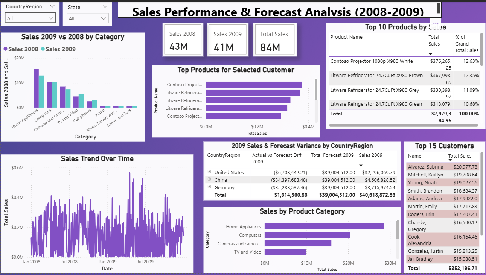

# Interactive Sales Performance & Forecast Analysis Dashboard (Power BI)

## Project Overview

This project demonstrates the development of a comprehensive, single-page interactive dashboard using Microsoft Power BI. The dashboard analyzes sales performance over two years (2008-2009), compares actual sales against forecasts for 2009, identifies key product and customer segments, and explores customer purchasing behavior. The primary goal was to transform raw sales and forecast data into actionable insights for a sales team.

*This project was developed based on a case study and utilizes sample data.*

## Live Interaction (Optional - If Published to Web)
*(If you published the report using Power BI Service's "Publish to web" feature, insert the public link or embedded code here. Otherwise, remove this section or state "Live interaction not available for this version".)*
*Example:*
*[Interact with the dashboard live here](Your_Publish_To_Web_Link)*

## Key Features & Analysis Implemented

*   **Executive Summary KPIs:** Clear view of Total Sales, Sales 2008 vs. 2009.
*   **Sales Trend Analysis:** Monthly sales trends visualized for identifying patterns over the two-year period.
*   **Actual vs. Forecast Variance (2009):** Matrix comparing actual 2009 sales against provided forecasts by Country/Region, highlighting performance differences. *(Conditional formatting can be added to visually emphasize variance)*.
*   **Product Performance:** Identification of the Top 10 Products by sales value and their percentage contribution to total sales.
*   **Customer Segmentation & Behavior:**
    *   Analysis of Top 15 Customers based on total purchase amount.
    *   Dynamic visualization showing the Top 5 products purchased specifically by a selected customer, revealing buying preferences.
*   **Sales Breakdown:** Analysis of sales distribution across different Product Categories.
*   **User Interactivity:**
    *   Dropdown slicers for filtering the entire report by Country/Region and State.
    *   Cross-filtering enabled: Clicking elements in one visual dynamically filters others for deeper exploration.

## Technical Skills Demonstrated

*   **Tool:** Microsoft Power BI Desktop
*   **Data Modeling:**
    *   Designed a Star Schema connecting Sales (Fact) with Customers, Products, DimDate (Dimensions).
    *   Managed relationships considering different data granularities (Sales vs. Forecast).
    *   Created a custom Date Dimension table using DAX for robust time intelligence.
*   **DAX (Data Analysis Expressions):**
    *   Developed complex measures for aggregation (`SUMX`), context modification (`CALCULATE`), time comparison (`CALCULATE` with Date filters), safe division (`DIVIDE`), and percentage calculations (`% of Grand Total`).
    *   Created measures to compare Actual vs. Forecast data.
*   **Data Visualization & Storytelling:**
    *   Selected appropriate chart types (Card, Line, Column, Bar, Table, Matrix) to effectively represent different data aspects.
    *   Designed a clean, single-page layout focused on user experience and insight delivery.
    *   Implemented interactive features (Slicers, Cross-filtering, Top N Filters).
    *   Applied consistent formatting and clear labeling.
*   **Data Transformation (Implicit):** Assumed data cleaning steps (e.g., Trim, Clean) were performed in Power Query during the initial phase (not shown in the final PBIX file analysis here).

## Dashboard Preview

*(Make sure 'Sales_Analysis_Project.png' is the exact filename of your main dashboard screenshot)*

*Additional Views:*
*(Include other relevant screenshots you uploaded, adjusting filenames accordingly)*

 *(Rename this screenshot file if needed to better reflect customer interaction)*

## Potential Enhancements (Future Scope)

*   Implementing more advanced time intelligence functions (e.g., YTD, MTD comparisons).
*   Adding drill-through pages for more detailed analysis of specific products or customers.
*   Incorporating more sophisticated conditional formatting in tables and matrices.
*   Optimizing DAX measures and the data model for larger datasets.

---

*Connect with me on [LinkedIn](https://www.linkedin.com/in/emad-ali-emad-886647199/) or view my [Data Science Portfolio](https://www.datascienceportfol.io/emadaliemad375).*
